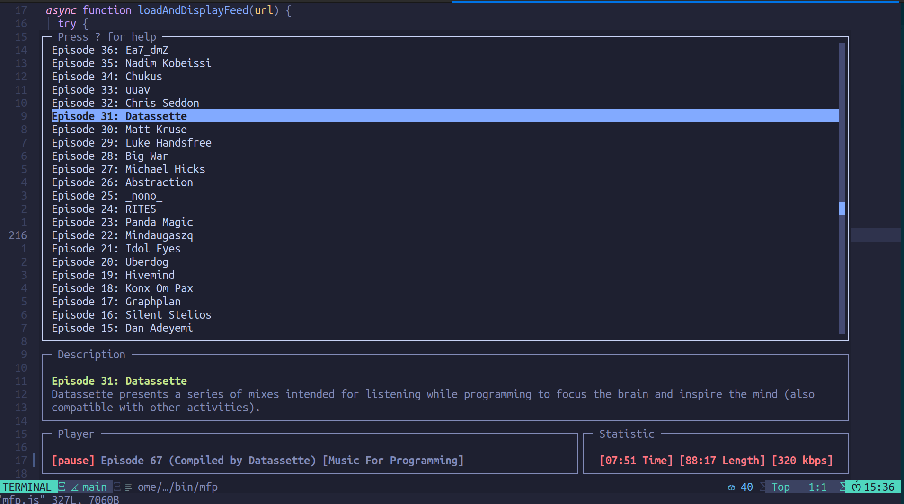

# Music For Programming

> A small music app that runs in the CLI and can be easily integrated into vim (MPD Client).

Inspired by [musicforprogramming.net](https://musicforprogramming.net/latest/)



## installation

### mpd

[Music_Player_Daemon Wikipedia](https://en.wikipedia.org/wiki/Music_Player_Daemon)

```bash
# install Music Player Daemon
sudo apt install mpd

# comment out audio_output for alsa
vim /etc/mpd.conf

# An example of an ALSA output:
#
audio_output {
        type            "alsa"
        name            "My ALSA Device"
#       device          "hw:0,0"        # optional
#       mixer_type      "hardware"      # optional
#       mixer_device    "default"       # optional
#       mixer_control   "PCM"           # optional
#       mixer_index     "0"             # optional
}

# restart mpd
systemctl restart mpd

# and enable mpd
systemctl enable mpd
```

### mfp.js

#### ENV

```bash
MFP_FEED default: "https://musicforprogramming.net/rss.xml"
MFP_PORT default: 6600,
MFP_HOST default: "localhost",
```

```bash
git clone git@github.com:tinoschroeter/mfp.git
cd mfp

npm install -g .
```

### vim

```lua
vim.keymap.set("n", "<leader>m", function()
  Util.float_term({ "mfp" })
end, { desc = "Music" })

```
